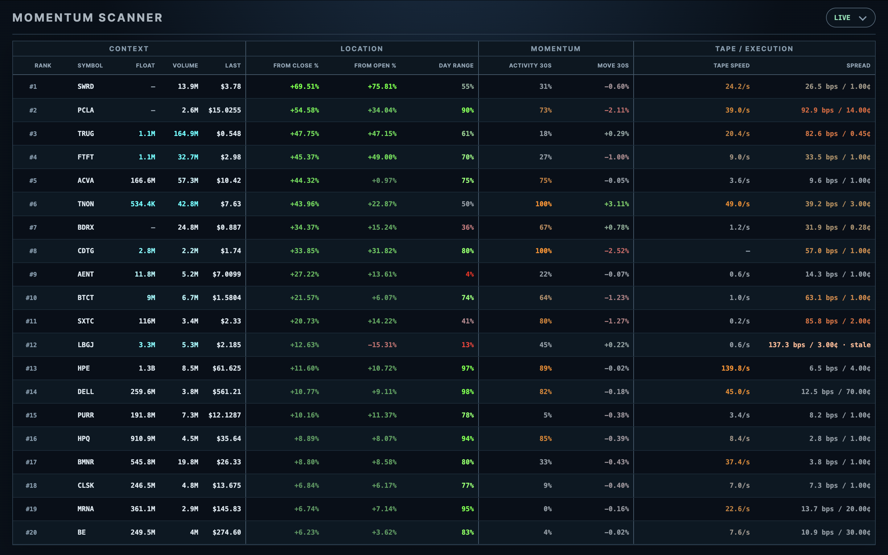

# Live Equities Momentum Scanner

A real-time U.S. equities scanner built in Go for discretionary momentum
research and monitoring. The system screens the eligible market for sustained
trading activity, ranks qualified stocks by return from the previous adjusted
close, and presents up to 20 leaders with price, volume, and trade-and-quote
measurements.



A large percentage gain alone does not describe the trading activity behind a
move. The scanner separates activity qualification from return-based ranking,
then provides measurements of session location, recent volume participation,
short-term returns, trade frequency, and quoted spread. These measurements help
a trader examine the conditions accompanying a move as they develop.

The project integrates historical data acquisition, live feed processing,
rolling feature calculations, correction-aware market state, and an independent
browser dashboard. It runs locally for a single operator using Massive market
and reference data.

## Market Universe and Selection

The eligible universe consists of active U.S. common shares and common-stock
American depositary receipts (ADRs). ETFs, ETNs, preferred shares, warrants,
rights, units, funds, and inactive or non-U.S. listings are excluded. The
scanner covers the extended session from 04:00 to 20:00 New York time.

Qualification evaluates rolling 60-second windows of one-second aggregates.
A passing window must satisfy every requirement below:

| Criterion | Requirement |
| --- | --- |
| Latest price | At least $0.25 |
| Aggregate coverage | At least 45 of 60 seconds |
| Maximum gap | No more than 3 consecutive missing seconds, including window boundaries |
| Estimated trade count | At least 1,000 over 60 seconds |
| Dollar volume | At least $250,000 over 60 seconds |
| Recent estimated trade count | At least 100 over the final 5 seconds |
| Volume concentration | No single second contributes more than 50% of the window's share volume |

Estimated trade counts are calculated as aggregate volume divided by average
trade size, summed over the relevant window. Dollar volume is the sum of
aggregate volume multiplied by volume-weighted average price (VWAP).

The first passing window establishes qualification for the session. A provider
correction can revoke the sole passing evidence within the 16-minute correction
horizon; after that evidence is finalized, subsequent quiet trading does not
revoke qualification.

Qualified, rankable stocks are ordered by percentage return from the immediately
preceding regular session's adjusted close, with symbol order breaking ties.
The dashboard displays the first 20. Float and the other contextual measurements
do not affect qualification or ranking. During incomplete population coverage,
any provisional ordering is explicitly marked as partial.

## Scanner Measurements

| Measurement | Definition |
| --- | --- |
| **Rank** | Position among qualified, rankable stocks by return from the previous adjusted close. |
| **Float** | Provider-reported public free float in shares, when available. |
| **Volume** | Cumulative share volume from accepted aggregates in the current extended session. |
| **Last** | Close of the latest accepted one-second aggregate. |
| **From Close** | Percentage return from the previous regular session's adjusted close. |
| **From Open** | Percentage return from the open of the first accepted aggregate in the current extended session. |
| **Day Range** | Latest price's relative position between the session low and high, expressed from 0% to 100%. |
| **Activity 30s** | Empirical percentile of current 30-second share-volume activity against 55 preceding 30-second reference windows. |
| **Move 30s** | Signed percentage price change over the preceding 30 seconds. |
| **Tape Speed** | Distinct qualifying original trades per second over the preceding 5 seconds. |
| **Spread** | Latest valid bid–ask spread in basis points and cents. |

Activity 30s compares the current window with reference windows sampled every
five seconds across the preceding five minutes. The references overlap one
another but do not overlap the current window. A high reading indicates elevated
recent volume relative to that stock's own history; it is not a probability or
a directional signal.

Trade and quote subscriptions are limited to the qualified displayed symbols.
Tape speed and spread require their own confirmed coverage and can be
unavailable independently. Warming, stale, invalid, and missing measurements
have explicit states; unavailable data is never presented as measured zero.

## System Architecture

The backend maintains one authoritative `ScannerStateEngine`. Concurrent
adapters acquire and normalize provider data, while a single ordered execution
path owns canonical symbol state, qualification, ranking, and publication.

- **Historical and live reconciliation.** Startup hydrates aggregates from
  session start while buffering live ingress. Historical and live bars use the
  same identity and merge rules, allowing a mid-session start to recover earlier
  activity and session measurements.
- **Deterministic event processing.** Live facts retain connection epoch, frame
  sequence, and array position. State updates follow explicit ordering rather
  than goroutine completion order, including correction handling.
- **Coherent snapshot publication.** Aggregate evaluation commits at a shared
  watermark—the time boundary through which the population has been evaluated.
  Immutable snapshots reach the dashboard through a versioned local API, so
  readers cannot observe partially applied state.
- **Bounded processing and failure isolation.** Queues, retained state, retries,
  and external work are bounded. Under feed pressure, trade-and-quote enrichment
  can be shed while aggregate and control facts continue through processing.
  Enrichment availability does not determine aggregate ranking or readiness.
- **Independent presentation.** The dashboard reads backend snapshots and owns
  rendering, not market calculations. It can restart without resetting scanner
  state, and browser work remains outside the engine's mutation path.

## Local Development

The project uses Go 1.26. Live operation requires authorized Massive market-data
access, with credentials supplied at runtime.

From the repository root on macOS:

```text
./scripts/run-private-scanner --open
```

The dashboard opens at `http://127.0.0.1:4173`.

Run the standard offline test suite with:

```text
go test -short -timeout 2m ./...
```

## Validation and Scope

The supported workflow is a fresh-start local live scanner. Each process start
resolves reference data and hydrates session history before reconciling with
the live stream. Replay and checkpoint packages have been removed; process
restart uses fresh hydration.

Offline verification covers implemented calculations, state transitions,
accounting, and failure handling. A [recorded ten-minute extended-hours provider
observation](docs/live-backend-replacement/evidence/lbr-e3-stability-live-2026-08-25.json) completed hydration and sustained 468 consecutive ready samples
with valid accounting and no snapshot or dashboard HTTP failures. This bounded
observation does not establish regular-session capacity or latency guarantees.
Public hosting and multi-user operation remain outside the current scope.

The scanner measures observed market conditions. It does not generate trade
entries or exits, route orders, or manage positions. Predictive value and
executable trading expectancy require separate evaluation with explicit
latency, liquidity, slippage, fees, and position-sizing assumptions.
