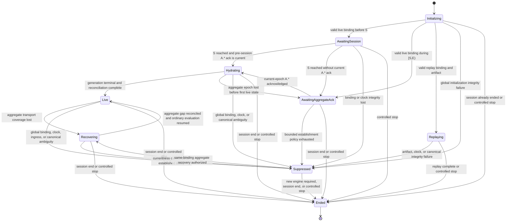

# Scanner State Engine lifecycle

**Status:** Approved architecture contract.

**Prepared:** 2026-08-05

**Approved:** 2026-08-05

**Scope:** Top-level `ScannerStateEngine` states, legal transitions, ordered
state mutation, startup and replay modes, hydration and aggregate-gap recovery,
publication and readiness boundaries, session termination, and failure-domain
containment. Provider wire mappings, feature formulas, numeric timing and
capacity thresholds, checkpoint encoding, API serialization, and package layout
belong in focused specifications.

## 1. Authority and purpose

[`../product/product-goals.md`](../product/product-goals.md) controls product
behavior. [`system-overview.md`](system-overview.md) controls component ownership
and runtime topology.
[`data-time-and-event-contract.md`](data-time-and-event-contract.md) controls
event identity, ordering, session time, coverage, reconciliation, and the
committed watermark. This document defines how the sole mutable state owner
moves between operational states while preserving those contracts.

The lifecycle has one central requirement:

> Every active state either processes ordinary work, waits for a named external
> or scheduled event, or terminates explicitly. No state may release its work,
> freeze the committed watermark, and then wait for an event that the state
> itself prevents from being processed.

Normative requirements use `LIFE-*` identifiers. Examples explain the contract
but do not weaken it.

## 2. Lifecycle model

### LIFE-MODEL-01 — one engine run, one session binding

One `ScannerStateEngine` instance owns at most one session binding for its
lifetime. It does not replace that binding in place with a different trading
date, universe, or prior-close policy. A new session binding requires a new
engine instance and initialized run.

Within the bound run, the engine exclusively owns:

- the top-level lifecycle state;
- canonical per-symbol state;
- active connection epoch and hydration generation;
- admitted-input consumption and `engine_sequence`;
- aggregate coverage and the committed watermark `T`;
- hydration/recovery outcomes and exact accounting;
- feature, qualification, ranking, T/Q intent, and readiness state; and
- immutable snapshot and checkpoint-view creation.

Network readers, REST workers, replay readers, checkpoint writers, API handlers,
and the UI return facts or consume immutable views. They do not transition the
engine or mutate canonical state directly.

### LIFE-MODEL-02 — ordered transition execution

Every lifecycle transition and canonical mutation occurs while consuming one
admitted input in `engine_sequence` order. A concurrent worker may finish at any
time, but completion order is not state order.

Processing one input is logically atomic:

```text
consume admitted input
  -> validate lifecycle, binding, epoch/generation, interval, and source position
  -> accept, reject, or terminally classify it
  -> mutate canonical state and accounting if permitted
  -> apply any lifecycle transition
  -> evaluate affected product state at committed T
  -> atomically publish a new immutable snapshot when output changed
```

The implementation may divide this work into private functions. It may not
publish a snapshot between partially applied steps.

### LIFE-MODEL-03 — top-level state is not every status dimension

The top-level lifecycle answers which class of session work the engine is
performing. The following remain separate state dimensions owned by the same
engine:

- ranking status and ranking currentness;
- backend readiness;
- fresh versus checkpoint bootstrap mode;
- per-symbol hydration outcome and field coverage;
- qualification state;
- T/Q desired, acknowledged, warming, active, and pressure state;
- checkpoint load/write status;
- API/UI availability; and
- bounded failure and termination reasons.

These dimensions may affect published output, but they do not become competing
lifecycle authorities. In particular:

- `degraded_bootstrap` is a ranking projection, not a lifecycle state;
- `normal`, `taq_degraded`, and `aggregate_only` are T/Q pressure states, not
  scanner lifecycle states;
- checkpoint export or write progress is not a scanner lifecycle state; and
- a symbol field being `warming`, `stale`, `unavailable`, or `invalid` is not a
  global transition.

### LIFE-MODEL-04 — transition cause and reason are observable

Every top-level transition records:

- previous and next state;
- engine time and `engine_sequence`;
- fixed bounded transition reason;
- active session binding;
- applicable connection epoch and hydration generation; and
- the last committed watermark, if one exists.

Raw payloads, unbounded error strings, and high-cardinality transition labels
are not required and must not create unbounded retained state.

## 3. Top-level lifecycle states

The complete version 1 top-level state vocabulary is:

```text
initializing
awaiting_session
awaiting_aggregate_ack
hydrating
live
recovering
replaying
suppressed
ended
```

No component specification may add a top-level state to work around a missing
transition. A new state requires an architecture amendment defining its owner,
entry, permitted work, progress event, exit, and publication behavior.

### 3.1 State diagram



`S` and `E` are the bound 04:00 and 20:00 America/New_York session instants.

### 3.2 State summary

| State | Meaning | Aggregate `T` | Contracted ranking | New T/Q promotion | Required progress or exit |
| --- | --- | --- | --- | --- | --- |
| `initializing` | Establish and validate one run mode and session binding; optionally validate/install a checkpoint. | Absent, or installed `T0` not yet current. | Unavailable; an installed checkpoint may be exposed only as retained noncurrent state. | No. | Binding succeeds, initialization fails globally, stop, or bound session is already over. |
| `awaiting_session` | Live run is prepared before `S`; preconnect may occur but market-time processing has not begun. | Absent. | Unavailable/noncurrent. | No. | `S`, binding/clock failure, or stop. |
| `awaiting_aggregate_ack` | Live run lacks a causally valid current-epoch `A.*` acknowledgement. | Absent or retained noncurrent `T0`. | Unavailable or explicitly retained stale state. | No. | Current acknowledgement, establishment-policy exhaustion, session end, or stop. |
| `hydrating` | Fresh or checkpoint bootstrap is reconciling historical prefix and current live tail. | May advance under the data/time and degraded-publication contracts. | Unavailable, `degraded_bootstrap`, or `qualified_current`. | Only from `qualified_current`, never from degraded output. | Generation becomes terminal and fenced, epoch is lost, global integrity fails, session ends, or stop. |
| `live` | Startup work is terminal and ordinary canonical evaluation owns progress. | Advances toward the current target when coverage and fences permit. | `qualified_current`, permitted `degraded_bootstrap`, unavailable, or a legitimately empty exact table. | Yes, only from a current qualified snapshot and subject to T/Q pressure/acknowledgement rules. | Ordinary inputs/timers, aggregate coverage loss, global integrity failure, session end, or stop. |
| `recovering` | A previously live run is re-establishing aggregate coverage across a known gap. | Retained at the last supported boundary until the gap is reconciled. | Stale, unavailable, or globally suppressed; not current through the gap. | No; existing T/Q coverage is closed. | New epoch/ack, terminal gap work and fence, bounded retry, suppression, session end, or stop. |
| `replaying` | A validated aggregate artifact and simulated clock drive the ordinary canonical state/evaluator offline. | Advances under deterministic replay time. | Qualified, degraded, unavailable, or legitimately empty relative to replay `T`, always identified as replay output. | No in version 1 because T/Q replay is deferred. | Next replay record/timer, artifact end, integrity failure, or stop. |
| `suppressed` | A material global integrity condition prevents a trustworthy current ranking claim. | Does not advance past the last supported boundary. | Globally suppressed with a fixed reason; contracted current rows are not published. | No; coverage is closed. | Explicit same-binding recovery, new-engine termination, session end, or stop. |
| `ended` | The bound engine run is terminal. | Final supported `T`, at most `E`. | Final nonlive/session-ended result. | No; all desired membership is empty. | None within this engine run. |

## 4. Initialization and pre-session behavior

### LIFE-INIT-01 — run mode is explicit

Initialization selects exactly one run mode:

```text
live | replay
```

A run cannot switch between live and replay while preserving canonical state.
Live and replay use the same normalized aggregate acceptance, canonical state,
features, qualification, ranking, and publication path after their respective
input establishment. They do not pretend to have the same transport evidence.

### LIFE-INIT-02 — live binding establishment

Before live market state can be accepted, initialization must establish one
coherent session binding containing the schedule-derived trading date, `S`,
`E`, eligible-universe identity, required prior-session date, prior-close
policy, and stable binding identifier.

Reference retrieval may be concurrent outside the engine, but the engine
installs the completed immutable binding in one ordered transition. Missing or
invalid per-symbol prior closes are canonical symbol categories. An invalid or
ambiguous global binding prevents live initialization.

If engine time is:

- before `S`, transition to `awaiting_session`;
- in `[S,E)`, transition to `awaiting_aggregate_ack`; or
- at or after `E`, transition to `ended` without claiming a live-current
  session.

### LIFE-INIT-03 — checkpoint discovery and install

After the current binding is known, live initialization attempts to discover
and validate the latest compatible checkpoint. If one exists, the engine
installs it before catch-up. Validation completes before any checkpoint state
becomes canonical.

Outcomes are:

- a valid compatible checkpoint installs coherent aggregate state at `T0` and
  selects checkpoint catch-up;
- no checkpoint, an incompatible checkpoint, or a corrupt checkpoint selects
  fresh hydration and records a bounded reason; and
- an error that also invalidates the active session binding enters
  `suppressed`.

Rejecting a checkpoint is not by itself a global scanner failure. The engine
never partially installs a rejected checkpoint. T/Q connection membership,
causal coverage, and instantaneous T/Q measurements are always empty after
process start.

### LIFE-INIT-04 — pre-session waiting and preconnect

`awaiting_session` permits reference/checkpoint status publication and bounded
live transport establishment before `S`. It does not accept a market event into
the bound session before `S`, advance `T` to a future instant, or publish a
current ranking.

The live adapter may establish and acknowledge `A.*` before `S`. The engine
records the current epoch and acknowledgement evidence, but the live handoff is
clamped to `R=S`. At `S`:

- a still-current acknowledged aggregate epoch transitions directly to
  `hydrating`; or
- an absent/lost acknowledgement transitions to `awaiting_aggregate_ack`.

This permits readiness at the opening boundary without treating pre-session
wall time as market coverage.

### LIFE-INIT-05 — initialization progress and failure

`initializing`, `awaiting_session`, and `awaiting_aggregate_ack` remain
observable and consume their permitted control/timer inputs. Bounded retrieval,
connection, and acknowledgement retry policies must provide scheduled progress
events. Exhaustion transitions to `suppressed`, or to `ended` at session end or
controlled stop; it does not leave the engine waiting without another scheduled
or external event.

## 5. Aggregate acknowledgement and startup hydration

### LIFE-HYDRATE-01 — acknowledgement establishes the live handoff

The engine enters `hydrating` only after consuming a successful `A.*`
acknowledgement from the active connection epoch at a valid live causal
position. It calculates `R` from acknowledgement receipt as required by
`DTE-RECOVERY-02`.

An aggregate delivered at or before the acknowledgement causal position cannot
establish the trusted current-epoch live tail. An aggregate delivered after the
acknowledgement may be accepted if every ordinary structural, binding, session,
and ordering rule passes.

### LIFE-HYDRATE-02 — one startup generation and explicit mode

Entering `hydrating` starts one positive hydration generation with mode:

```text
fresh_bootstrap | checkpoint_catchup
```

The planned interval is:

```text
fresh_bootstrap:    [S,R)
checkpoint_catchup: [T0,R)
```

Every planned symbol request has one terminal outcome. Progress is observable
but nonterminal. The mode controls the requested interval and initial state; it
does not select a different ranking evaluator or mark definition.

### LIFE-HYDRATE-03 — live tail remains active

During `hydrating`, the engine continues consuming current-epoch live frames,
control events, aggregate events, timers, and hydration results. REST workers
do not own priority over live ingress, and completion of REST work does not
allow publication past an unreconciled live fence.

Historical and live aggregates merge by the common identity and precedence
rules. A REST result cannot overwrite an accepted live identity. A live event
accepted while hydration runs remains eligible for the same ordinary feature,
qualification, and ranking evaluation used later in `live`.

### LIFE-HYDRATE-04 — publication while hydrating

Hydration does not create a second watermark or ranking path. At candidate `T`,
the engine may publish:

- `qualified_current` when complete-population evidence already supports the
  exact contracted table;
- `degraded_bootstrap` when every predicate in `PG-RANK-05` and the committed-
  watermark contract holds; or
- unavailable status otherwise.

A zero-trusted-mark unresolved population is unavailable, not an empty degraded
table. A fully resolved population with zero qualified rows may be an exact
legitimately empty table.

T/Q intent follows ranking status, not the word `hydrating`: a current
`qualified_current` snapshot may create desired T/Q membership even if only
display-field hydration remains. A degraded or unavailable snapshot cannot
create new T/Q subscriptions. Leaving `qualified_current` closes desired
membership and current T/Q coverage according to the T/Q contract.

### LIFE-HYDRATE-05 — terminal completion and ingress fence

A startup generation is ready to close only when:

1. every planned request has exactly one terminal outcome;
2. the generation, binding, symbols, and requested intervals have been
   validated;
3. a post-hydration live ingress fence has been captured;
4. every classified item through that fence has been consumed or explicitly
   rejected; and
5. terminal outcomes and canonical consequences have been reconciled into
   exact work and symbol accounting.

`completed_empty` is terminal successful work. It establishes empty coverage
for its exact interval and participates in `no_print_through(T)` only when the
complete proof in the data/time contract holds. Failed, canceled, or fenced
work becomes explicit unknown state and never masquerades as empty.

### LIFE-HYDRATE-06 — completion always leaves hydrating

After the conditions above hold, the engine must leave `hydrating` in the same
ordered transition:

- enter `live` when the binding and canonical state remain globally coherent;
- enter `suppressed` only when a material global ambiguity makes even the
  permitted current product projections untrustworthy; or
- enter `ended` if the session ended or controlled termination was requested.

Per-symbol failed/fenced history does not keep completed work pending. It may
leave ranking degraded/unavailable or a dependent field unavailable after the
transition to `live`, but ordinary accepted aggregates and timers continue to
receive evaluation.

There is no `deferred` terminal state and no guard that prevents ordinary
evaluation merely because the market produced few marks.

### LIFE-HYDRATE-07 — epoch loss before startup completes

If aggregate coverage is lost before the first transition to `live`, the engine:

1. closes current aggregate and T/Q coverage at the known causal boundary;
2. cancels the active hydration generation, assigning each still-open request
   one terminal `canceled` outcome;
3. fences any later deliveries from that generation without creating a second
   terminal outcome;
4. retains canonical facts already accepted under valid evidence;
5. stops current ranking claims; and
6. returns to `awaiting_aggregate_ack` for a new epoch.

After the new acknowledgement, a new generation replans the exact coverage
needed through the new `R`. Reuse of previously accepted canonical facts is
permitted; reuse of old-generation completion as proof for an uncovered
interval is not.

## 6. Ordinary live operation

### LIFE-LIVE-01 — entry meaning

Entry into `live` means startup hydration work is terminal, its required fence
is reconciled, and the engine has returned to the ordinary state/evaluation
path. It does not guarantee that the ranked table has 20 rows or that every
field and T/Q measurement is current.

Legal live ranking outcomes are derived from evidence:

- exact `qualified_current`, including a resolved empty table;
- current `degraded_bootstrap` when bootstrap-origin unknown categories remain
  and `PG-RANK-05` permits the partial view;
- unavailable when no permitted current projection is supportable; or
- globally suppressed output only after a transition to `suppressed`.

### LIFE-LIVE-02 — ordinary progress

In `live`, current-epoch aggregate events, accepted corrections, timers,
coverage changes, and other admitted control facts all retain a path to the one
ordinary evaluator.

On a timer, the engine calculates the candidate target and advances `T` when
the data/time advancement requirements hold. A timer may change qualification,
window membership, proof finalization, mark age, field availability, or no-print
coverage even when no symbol prints during that second.

An accepted aggregate or correction may produce a new snapshot at the current
`T` before a later timer advances it. Snapshot publication identity, not `T`
alone, distinguishes that revision.

### LIFE-LIVE-03 — no-print transition under live coverage

For a symbol already proved `no_print_through(T)`, continuous accepted wildcard
aggregate transport coverage and timer advancement may extend that proof to a
later committed watermark without additional REST work. A later canonically
accepted aggregate immediately replaces no-print with a real mark state and
triggers ordinary feature, qualification, accounting, and ranking reevaluation.

No global recovery transition is required for the normal first print of a quiet
symbol.

### LIFE-LIVE-04 — checkpoint production is subordinate

When a committed boundary satisfies the version 1 checkpoint cadence, the
engine produces an immutable coherent checkpoint view. Encoding, validation,
temporary-file writing, and atomic replacement occur outside the ordered
mutation path.

A checkpoint export, submission, validation, or write failure updates bounded
checkpoint diagnostics but does not leave `live`, freeze `T`, invalidate
aggregate ranking, or wait synchronously on file I/O. A stale write result from
an obsolete binding/request is recorded or fenced without mutating canonical
state.

### LIFE-LIVE-05 — API and UI are readers

The API reads the latest immutable snapshot. API backpressure, disconnected
clients, schema negotiation errors, and UI deployment do not produce scanner
lifecycle transitions. The engine continues live processing and checkpointing
without a UI.

## 7. Aggregate transport recovery

### LIFE-RECOVER-01 — entry trigger and immediate actions

Only a loss or ambiguity that affects aggregate transport coverage enters
`recovering`. T/Q-only failure, checkpoint failure, field-local history failure,
API/UI failure, and replay failure do not.

On entry from `live`, the engine atomically:

1. records the last supported aggregate causal and market-time boundary;
2. stops advancing `T` past the unsupported gap;
3. marks the published ranking noncurrent/stale as required by the product
   trust contract;
4. closes all T/Q causal coverage and clears current T/Q measurements;
5. empties new T/Q desired promotion intent;
6. preserves the last canonical aggregate and derived state; and
7. requests a new live connection epoch through the adapter.

The retained state remains useful recovery input but does not prove currentness
through the gap.

### LIFE-RECOVER-02 — recovery substates are engine-owned steps

`recovering` has these ordered internal steps:

```text
awaiting_new_aggregate_ack
  -> hydrating_gap
  -> reconciling_fence
  -> ordinary_evaluation
```

These steps are not separate owners or ranking clocks. They identify the next
required event inside one top-level state:

- `awaiting_new_aggregate_ack` progresses on a current-epoch acknowledgement or
  a scheduled bounded reconnect decision;
- `hydrating_gap` progresses on terminal per-symbol results while accepting the
  new live tail;
- `reconciling_fence` progresses by consuming admitted live items through the
  captured fence; and
- `ordinary_evaluation` either returns to `live` or classifies the remaining
  integrity failure explicitly.

### LIFE-RECOVER-03 — exact gap and generation

After the new `A.*` acknowledgement, the engine fixes a catch-up boundary and
starts a new positive hydration generation for the exact missing aggregate
coverage. The hydration/recovery component specification defines the exact gap
start and any evidenced overlap, but the interval must include every aggregate
identity needed to join the last supported state to the new live tail.

Old-epoch live events and old-generation REST results are fenced. Current-epoch
live aggregates after the acknowledgement continue entering canonical state;
they do not wait for REST to finish.

### LIFE-RECOVER-04 — retry and supersession

A recoverable request/transport failure may start another bounded generation.
Superseding a generation assigns each open request one terminal `canceled`
outcome. A late delivery from the superseded generation is a fenced observation,
not a second terminal work outcome.

Retry policy must define a scheduled next action and a finite budget. While a
retry is scheduled, the engine remains `recovering` and observable. When the
budget is exhausted, the engine evaluates the terminal evidence instead of
remaining in an untriggered wait.

### LIFE-RECOVER-05 — completion classification

After all current-generation work is terminal and the recovery fence is
reconciled, the engine classifies remaining gaps:

- if aggregate coverage and complete-population evidence support the current
  product result, invoke the ordinary evaluator, advance as permitted, and
  transition to `live`;
- if a remaining failure is provably symbol/field-local and cannot change the
  supported aggregate ranking claim, transition to `live` with only the
  dependent symbol/field unavailable; or
- if an unresolved aggregate gap can affect complete-population ranking or the
  committed clock, transition to `suppressed` with a fixed unrecovered-gap
  reason.

Same-process recovery does not relabel an unsupported global gap as empty and
does not create a second recovery ranking evaluator. It does not remain
`recovering` after all work and retries are terminal.

### LIFE-RECOVER-06 — loss of the recovery epoch

If the new aggregate epoch is lost while recovery is active, the engine closes
its live-tail coverage, cancels/fences the current generation as above, retains
canonically accepted facts, and returns to
`awaiting_new_aggregate_ack` within `recovering`.

Repeated epoch loss is bounded by the recovery policy. Exhaustion transitions
to `suppressed` or `ended`; it never creates an infinite inactive recovery
stage.

## 8. T/Q lifecycle interaction

### LIFE-TQ-01 — ranking drives desired membership

The engine derives desired T/Q membership from each current
`qualified_current` snapshot: all displayed rows, up to 20. A current exact
empty table has an empty desired set.

`degraded_bootstrap`, stale, unavailable, suppressed, replay, and ended output
cannot create new T/Q subscriptions. When ranking leaves `qualified_current`,
the engine closes affected desired membership and requests best-effort
unsubscription of known provider members.

### LIFE-TQ-02 — acknowledgement and measurements are subordinate

T/Q command intent, write outcome, acknowledgement, causal coverage, warming,
measurement, and pressure changes are consumed as ordered facts but do not
change the top-level scanner lifecycle unless the shared transport failure also
invalidates aggregate/control processing.

An isolated malformed trade or quote is rejected within its channel. A raw
frame ambiguity that prevents the adapter from determining whether aggregate or
control data was lost is an aggregate-ingress integrity failure and follows the
aggregate recovery/suppression path.

### LIFE-TQ-03 — pressure never blocks aggregate progress

The pressure module progresses independently through `normal`,
`taq_degraded`, and `aggregate_only` according to its focused specification.
Intentional T/Q rejection or unsubscribe closes causal coverage and makes
dependent fields warm/unavailable.

No T/Q pressure state may:

- stop the shared socket reader;
- discard a whole mixed frame before aggregate/control classification;
- delay an admitted aggregate behind optional feature work indefinitely;
- prevent committed-watermark advancement; or
- change aggregate qualification, ranking, or backend readiness.

When pressure recovers, T/Q promotion resumes gradually from the current
qualified ranking and every affected feature warms from new acknowledged
coverage.

## 9. Deterministic replay lifecycle

### LIFE-REPLAY-01 — replay initialization

A replay run enters `replaying` only after validating:

- one session binding;
- replay schema and artifact identity;
- artifact provenance and normalization policy;
- ordered record ordinals and logical delivery times; and
- the coverage manifest needed to distinguish complete absence from missing
  artifact data.

The run may start at `S` from an empty canonical state or install one compatible
coherent checkpoint at `T0` and continue from its exact cutoff. Checkpoint
validation and atomic installation follow `LIFE-INIT-03`; a rejected optional
checkpoint falls back to session-open replay only when the artifact contains
the complete required continuation from `S`.

An artifact without the evidence needed for a product claim may still be used
by an explicitly partial test scenario, but it cannot establish whole-session
no-print or exact complete-population ranking.

### LIFE-REPLAY-02 — same state and evaluator, different transport claim

`replaying` consumes normalized aggregate records and deterministic timer events
through the same ordered engine acceptance, canonical merge, feature,
qualification, accounting, ranking, and snapshot path as live operation.

It does not open the live adapter, wait for `A.*`, create live connection
epochs, or claim live receipt latency. Version 1 T/Q fields remain unavailable
with a replay-specific reason because full-session T/Q replay is deferred.

Snapshots identify replay mode. Ranking may be exact/current relative to replay
time and artifact coverage, but replay output does not make the production live
backend ready.

### LIFE-REPLAY-03 — deterministic progress and completion

The next replay record or required whole-second timer is always the progress
event. Playback controls change wall-duration scheduling only; they do not
change logical delivery order or engine time.

At artifact completion, the engine delivers every required timer through the
requested replay end, completes final evaluation, publishes a terminal replay
snapshot, and transitions to `ended`. A malformed ordinal, regressing simulated
clock, incompatible binding, or canonical ambiguity transitions to
`suppressed`; corrected replay input requires a clean replay run rather than
mutating the failed canonical history in place.

## 10. Suppression and restoration

### LIFE-SUPPRESS-01 — suppression is global and explicit

The engine enters `suppressed` only when a material global condition makes the
permitted current ranking claims untrustworthy. Examples include:

- invalid or mismatched session binding after state installation;
- engine-time regression;
- aggregate/control ingress loss whose contents cannot be classified;
- canonical-state ambiguity that cannot be isolated to a symbol/field;
- unrecovered aggregate gap capable of changing complete-population ranking;
- accounting invariant failure; or
- incompatible state discovered after a supposedly atomic install.

Per-symbol invalid data, field-history gaps, T/Q failures, checkpoint write
failures, and API/UI failures do not qualify unless they expose a genuinely
global ambiguity.

### LIFE-SUPPRESS-02 — entry actions

On entry, the engine:

1. records a fixed suppression reason and supporting boundaries;
2. stops committed-watermark advancement past the supported point;
3. publishes globally suppressed ranking status with a fixed reason and no
   contracted current ranking rows;
4. closes T/Q desired membership and causal coverage;
5. cancels or fences active hydration work as appropriate; and
6. continues draining/classifying bounded inputs so transport cannot deadlock.

Last-known rows may be retained only as explicitly noncontracted diagnostic
state. They cannot appear as a current or degraded ranking.

### LIFE-SUPPRESS-03 — every suppression has a disposition

At entry, the reason maps to one of these dispositions:

```text
same_binding_recovery_allowed
clean_reinitialization_required
restart_required
terminal_replay_failure
```

- same-binding recovery requires an explicit scheduled or operator control
  event and transitions to `recovering` with a new epoch/generation;
- clean reinitialization ends the current instance after discarding its
  canonical state; a new engine instance begins at `initializing`;
- restart-required suppression proceeds to controlled `ended` after publishing
  its terminal reason; and
- terminal replay failure ends the failed run; corrected input starts an
  entirely new engine instance at `initializing` before it enters `replaying`.

An ordinary timer cannot silently clear suppression. The restoration event,
new evidence, and state discarded or retained must be explicit.

## 11. Session end and controlled termination

### LIFE-END-01 — session boundary

At engine time `E`, no event with effective event time at or after `E` can enter
the bound session. The engine consumes admitted aggregate/control work through
the final required fence, advances `T` to at most `E` when coverage supports it,
performs final evaluation, empties T/Q desired membership, closes T/Q coverage,
and transitions to `ended`.

An unresolved gap at session end is reported honestly; session termination does
not invent coverage merely to force `T=E`.

### LIFE-END-02 — controlled stop

A controlled stop before `E` is an ordered engine control event. The engine:

- stops requesting new provider or hydration work;
- terminally cancels open requests exactly once;
- closes T/Q desired membership and coverage;
- consumes or explicitly fences work through the shutdown boundary;
- publishes a final nonlive snapshot with termination reason;
- may issue a final checkpoint view only from an already coherent committed
  boundary; and
- transitions to `ended` without waiting indefinitely for network or disk I/O.

Exact shutdown timeouts and operating-system signal wiring belong in the
operations specification.

### LIFE-END-03 — ended is terminal

`ended` accepts no new market fact into canonical state. Late adapter, worker,
or writer results are ignored or counted as stale outcomes by process-level
cleanup; they cannot alter the terminal snapshot.

A new trading date or rerun creates a new engine instance and binding. There is
no `ended -> initializing` transition within the same engine run.

## 12. Input handling by lifecycle state

| Input | Initializing / awaiting session | Awaiting aggregate ack | Hydrating | Live | Recovering | Replaying | Suppressed | Ended |
| --- | --- | --- | --- | --- | --- | --- | --- | --- |
| Session binding / checkpoint install | Accept only through initialization rules. | Reject replacement binding; checkpoint install already closed. | Reject replacement binding. | Reject replacement binding. | Reject replacement binding. | Reject replacement binding. | Accept only as explicit clean reinitialization after discarding old state. | Reject. |
| Current-epoch `A.*` acknowledgement | May record pre-session ack in `awaiting_session`. | Accept and enter hydration. | Duplicate/control diagnostic only. | Control diagnostic only. | Accept for the new recovery epoch and begin gap work. | Not applicable. | Only under explicit recovery disposition. | Reject/stale. |
| Live aggregate | Reject before `S`; after ack ordering rules govern. | Reject before valid acknowledgement coverage. | Accept current-epoch post-ack events. | Accept current-epoch events. | Accept only in the acknowledged current recovery epoch/live tail. | Not applicable. | Drain/classify, but do not mutate state without authorized recovery. | Reject/stale. |
| Hydration terminal result | Accept only if initialization explicitly owns a validation result, not market hydration. | Fence/stale unless a generation is active by contract. | Accept current generation; fence stale generations. | Fence stale result; ordinary live has no active startup generation. | Accept current recovery generation. | Not applicable. | Cancel/fence unless explicit recovery is active. | Reject/stale. |
| Trade or quote | Reject before acknowledged selected coverage. | Reject/no coverage. | Accept only for acknowledged selected membership created by `qualified_current`. | Accept only for acknowledged selected membership. | Reject and close coverage. | Version 1 unavailable. | Reject and close coverage. | Reject/stale. |
| Timer/evaluation | Drive initialization deadlines or wait for `S`; no market publication before `S`. | Drive target/establishment status but cannot create coverage. | Drive target, degraded/exact evaluation, staleness, and deadlines. | Drive ordinary `T`, windows, finalization, and snapshots. | Drive retry/deadline/stale status without advancing past gap. | Drive deterministic replay time. | Drive disposition/deadline status; cannot clear suppression alone. | No product mutation. |
| T/Q command acknowledgement | Stale/no desired membership. | Stale/no desired membership. | Accept only for current qualified desired intent. | Accept for current intent/epoch. | Stale; coverage already closed. | Not applicable. | Stale; coverage closed. | Stale. |
| Checkpoint write result | Record only for a request already issued from coherent state. | Record matching prior request only. | Record matching request without lifecycle change. | Record matching request without lifecycle change. | Record matching prior request without lifecycle change. | Record replay-local request if enabled. | Record/fence without restoring state. | Cleanup diagnostic only. |
| API/UI activity | Immutable read only. | Immutable read only. | Immutable read only. | Immutable read only. | Immutable read only. | Immutable read only. | Immutable read only. | Immutable terminal read only. |

“Reject” in this table always means explicit bounded classification where the
input was admitted; it never authorizes silent disappearance of admitted work.

## 13. Lifecycle, ranking, and readiness combinations

### LIFE-PUBLISH-01 — process liveness is independent

Every nonterminated backend state may expose process liveness and its current
status. Process liveness makes no market-data correctness claim.

### LIFE-PUBLISH-02 — legal publication combinations

| Lifecycle | Legal ranking publication | Backend ready? | T/Q behavior |
| --- | --- | --- | --- |
| `initializing` | Unavailable; compatible checkpoint rows may be exposed only as retained noncurrent state. | No. | Empty/no coverage. |
| `awaiting_session` | Unavailable/noncurrent pre-session status. | No for the active session. | Empty/no coverage. |
| `awaiting_aggregate_ack` | Unavailable or retained stale state. | No. | Empty/no coverage. |
| `hydrating` | Unavailable, current `degraded_bootstrap`, or `qualified_current` when evidence is already exact. | Yes only when all `PG-OBS-03` readiness predicates hold; unresolved zero-mark bootstrap is not ready. | Promote only from current `qualified_current`; degraded/unavailable cannot promote. |
| `live` | `qualified_current`, permitted current `degraded_bootstrap`, unavailable, or exact empty qualified table. | Yes only for a coherent current publication through its fence; otherwise no. | Desired top 20 from current qualified rows; independent degradation allowed. |
| `recovering` | Retained stale or unavailable aggregate ranking. | No. | Coverage closed; no promotion. |
| `replaying` | Qualified, degraded, unavailable, or exact empty output relative to replay `T`, explicitly labeled with replay run mode. | Not production-live ready. | Unavailable in version 1. |
| `suppressed` | Globally suppressed with a fixed reason; no contracted current rows. | No. | Coverage closed; no promotion. |
| `ended` | Final session-ended/nonlive output at the last supported `T`. | No. | Empty/closed. |

The operations/API specifications define exact freshness thresholds and HTTP
status mappings. They may not make T/Q availability a backend-readiness
predicate or label a stale/suppressed/replay result as live-current.

### LIFE-PUBLISH-03 — ordinary publication continues after terminal startup

After transition from `hydrating` to `live`, ordinary timers and accepted
aggregates continue to reevaluate ranking even when startup ended with:

- a sparse candidate population;
- many `no_print_through(T)` symbols;
- below-price symbols;
- zero qualified rows;
- symbol-local historical-field failures; or
- explicit bootstrap-origin unknown categories.

These facts change output categories, not whether the ordinary evaluator runs.

## 14. Transition table

| ID | Current state | Consumed event and guard | Required action | Next state |
| --- | --- | --- | --- | --- |
| `LIFE-T01` | `initializing` | Valid live binding; engine time `< S` | Install binding/checkpoint outcome; prepare bounded preconnect. | `awaiting_session` |
| `LIFE-T02` | `initializing` | Valid live binding; engine time in `[S,E)` | Install binding/checkpoint outcome; request aggregate epoch. | `awaiting_aggregate_ack` |
| `LIFE-T03` | `initializing` | Valid replay binding, artifact, coverage, clock, and optional compatible checkpoint | Install clean replay state at `S` or coherent checkpoint state at `T0`. | `replaying` |
| `LIFE-T04` | `initializing` | Global binding/clock ambiguity or atomic checkpoint-install integrity failure | Publish fixed reason; choose suppression disposition. | `suppressed` |
| `LIFE-T05` | `initializing` | Engine time `>= E` or controlled stop | Publish nonlive terminal status. | `ended` |
| `LIFE-T06` | `awaiting_session` | Timer reaches `S`; current pre-session A.* ack remains valid | Calculate `R=S`; start fresh/checkpoint generation. | `hydrating` |
| `LIFE-T07` | `awaiting_session` | Timer reaches `S`; no current valid A.* ack | Request/continue aggregate epoch establishment. | `awaiting_aggregate_ack` |
| `LIFE-T08` | `awaiting_aggregate_ack` | Current-epoch A.* acknowledgement consumed in `[S,E)` | Calculate `R`; start fresh/checkpoint generation. | `hydrating` |
| `LIFE-T09` | `awaiting_aggregate_ack` | Stale/wrong-epoch acknowledgement | Reject with bounded reason; retain scheduled establishment path. | `awaiting_aggregate_ack` |
| `LIFE-T10` | `awaiting_aggregate_ack` | Establishment policy exhausted or global transport/control ambiguity | Publish unavailable/suppressed reason and disposition. | `suppressed` |
| `LIFE-T11` | `hydrating` | Current live aggregate, hydration result, control event, or timer | Apply ordinary ordered acceptance/evaluation and update progress. | `hydrating` |
| `LIFE-T12` | `hydrating` | All work terminal and fence reconciled; global state coherent | Finalize exact accounting; use ordinary evaluator. | `live` |
| `LIFE-T13` | `hydrating` | Aggregate epoch lost before first live entry | Cancel open work exactly once; fence old generation; preserve accepted facts. | `awaiting_aggregate_ack` |
| `LIFE-T14` | `hydrating` | Global binding/clock/canonical/ingress ambiguity | Close current claims and classify disposition. | `suppressed` |
| `LIFE-T15` | `live` | Accepted event, correction, timer, T/Q/checkpoint/control outcome | Apply affected ordinary state and publish when output changes. | `live` |
| `LIFE-T16` | `live` | Aggregate coverage loss/ambiguity with a known recovery boundary | Freeze currentness at supported T; close T/Q; request new epoch. | `recovering` |
| `LIFE-T17` | `live` | Material global integrity failure without safe ordinary claim | Stop current publication; choose disposition. | `suppressed` |
| `LIFE-T18` | `recovering` | Current new-epoch A.* acknowledgement | Fix recovery handoff; start exact gap generation. | `recovering` |
| `LIFE-T19` | `recovering` | Current gap result/live tail/timer/retry event | Apply/fence in engine order; advance recovery step, not T past gap. | `recovering` |
| `LIFE-T20` | `recovering` | Work terminal and fence reconciled; current aggregate claim is supportable | Invoke ordinary evaluator and restore currentness as evidence permits. | `live` |
| `LIFE-T21` | `recovering` | Recovery epoch lost with retry budget available | Cancel/fence generation; request next epoch. | `recovering` |
| `LIFE-T22` | `recovering` | Terminal/retry evidence cannot support current complete-population claim | Publish unrecovered-gap/global reason and disposition. | `suppressed` |
| `LIFE-T23` | `replaying` | Next ordered replay record or deterministic timer | Apply same canonical/evaluation path under replay clock. | `replaying` |
| `LIFE-T24` | `replaying` | Artifact end and final timers completed | Publish terminal replay output. | `ended` |
| `LIFE-T25` | `replaying` | Artifact/clock/canonical integrity failure | Stop replay claims; require corrected clean run. | `suppressed` |
| `LIFE-T26` | `suppressed` | Explicit same-binding recovery event with safe retained boundary | Start new aggregate epoch/generation; preserve only approved state. | `recovering` |
| `LIFE-T27` | `suppressed` | Explicit clean-reinitialization or restart decision | Discard failed canonical state as required and terminate this instance; the process may construct a new engine. | `ended` |
| `LIFE-T28` | `suppressed` | Corrected replay input is available | Terminate the failed replay instance; a new engine validates the corrected run from `initializing`. | `ended` |
| `LIFE-T29` | Any nonended state | Timer reaches `E` or controlled stop consumed | Finalize supported state, close/cancel work, publish termination. | `ended` |

Every transition not listed is illegal or a self-transition that processes a
permitted input without changing top-level state. Illegal admitted inputs are
explicitly rejected; they are not ignored as if successfully processed.

## 15. Progress, accounting, and safety invariants

The following invariants are binding across all focused specifications and
implementation:

1. Exactly one top-level lifecycle state is active.
2. Exactly one engine sequence orders lifecycle and canonical mutation.
3. Exactly one committed aggregate watermark governs rank and aggregate
   features.
4. A state transition is applied before its resulting immutable snapshot is
   published.
5. Every waiting state names its external or scheduled progress event.
6. Every retry policy is bounded and produces a terminal disposition when
   exhausted.
7. Every planned hydration request receives exactly one terminal outcome.
8. Canceling or superseding a request is its terminal outcome; a late delivery
   is fenced evidence, not a second completion.
9. `completed_empty` is terminal successful work for its exact interval.
10. `no_print_through(T)` is proved coverage, not a synthetic mark or pending
    work.
11. Completing startup hydration always leaves `hydrating`.
12. Completing all recovery work/retries always leaves the current recovery
    attempt in `live`, `suppressed`, or `ended`.
13. Accepted current-epoch aggregate changes always retain a route to ordinary
    evaluation unless an explicit global integrity transition suppresses the
    claim.
14. Checkpoint, T/Q, API, UI, and field-local failures cannot freeze aggregate
    evaluation.
15. Losing aggregate coverage closes currentness and T/Q coverage before any
    post-gap measurement is published as current.
16. T/Q pressure cannot become an aggregate watermark or readiness gate.
17. A checkpoint or hydration boundary cannot override `T`.
18. Live and replay output identify their run mode and never exchange transport
    claims.
19. Primary symbol accounting and per-generation work accounting reconcile in
    every published snapshot where their populations are in scope.
20. `ended` is terminal for one engine instance and session binding.

## 16. Required lifecycle proof scenarios

Focused component and integration specifications must allocate one primary
proof for each distinct behavior below without duplicating the entire matrix at
every test level:

1. Pre-04:00 initialization with preconnected `A.*` enters hydration at `S`
   without a future watermark.
2. Mid-session fresh start establishes `R`, processes live tail concurrently,
   reconciles every terminal symbol outcome, and enters `live`.
3. Valid empty results for a sparse population complete hydration, reconcile as
   no-print where coverage proves it, and do not freeze ordinary timers.
4. Checkpoint startup installs state at `T0`, catches up `[T0,R)`, reconciles the
   live fence, and produces the same ordinary evaluation as uninterrupted
   canonical state.
5. Invalid checkpoint rejection falls back atomically to fresh hydration with
   no partially installed state.
6. A current degraded bootstrap snapshot remains visibly partial, creates no
   T/Q promotion, and continues advancing under valid aggregate coverage.
7. A qualified snapshot reached while display fields still hydrate may create
   T/Q intent without making those fields falsely current.
8. Aggregate epoch loss during startup cancels each open request once, fences
   late results, re-acknowledges, replans coverage, and eventually exits
   hydration.
9. Ordinary live timers advance ranking during many quiet/no-print symbols; a
   later first print changes only the affected symbol state and reevaluates.
10. Same-process aggregate loss freezes currentness, closes T/Q, recovers the
    exact gap, and returns through the ordinary evaluator.
11. Recovery terminal failure either isolates a provably local field/symbol
    consequence or transitions to explicit suppression; it never remains an
    inactive terminal recovery stage.
12. Repeated connection loss exhausts a bounded policy and reaches suppression
    or termination rather than an untriggered wait.
13. T/Q decode, acknowledgement, pressure, and complete shedding failures leave
    lifecycle `live`, aggregate `T`, qualification, and ranking unchanged.
14. A mixed raw frame under T/Q pressure still preserves aggregate and control
    classification; a truly unclassifiable aggregate/control frame enters the
    explicit integrity path.
15. Checkpoint export and asynchronous write failures leave live evaluation
    advancing and retain the previous complete checkpoint.
16. API outage and UI deployment have no effect on engine state or checkpoint
    production.
17. The same aggregate replay artifact produces identical lifecycle transitions,
    committed watermarks, and market-time snapshots at different playback
    speeds.
18. Replay artifact corruption suppresses only the replay run and cannot affect
    a live backend.
19. Engine-time regression suppresses current ranking and cannot be cleared by
    an ordinary timer.
20. At `E`, final fencing/evaluation terminates without inventing coverage or
    waiting indefinitely for T/Q, REST, checkpoint, API, or UI work.

## 17. Deliberately delegated decisions

The following details must be fixed in their focused specifications before
dependent production implementation is complete, but they may not change this
lifecycle:

- schedule/reference retrieval retry and cache policy;
- aggregate connection establishment and acknowledgement deadlines;
- evaluation delay, freshness thresholds, and correction horizon;
- REST concurrency, page/request bounds, retry budgets, and generation limits;
- exact recovery interval overlap and symbol-local completeness proof;
- feature retained structures, update algorithms, and availability reasons;
- T/Q pressure thresholds, hysteresis, command timing, and warm-up details;
- checkpoint cadence, schema, retained-state encoding, and restart objective;
- replay artifact encoding, storage, controls, and provider-data restrictions;
- snapshot schema, update transport, HTTP readiness mapping, and UI behavior;
- bounded metric names, log sampling, and diagnostic retention; and
- shutdown deadlines and process-supervisor integration.

These decisions may tune performance and implementation mechanics. They may not
add competing mutable owners, a second ranking clock/evaluator, nonterminal
empty work, an unexitable recovery state, T/Q-to-ranking dependence, mixed-time
checkpoints, or browser-owned product state.
