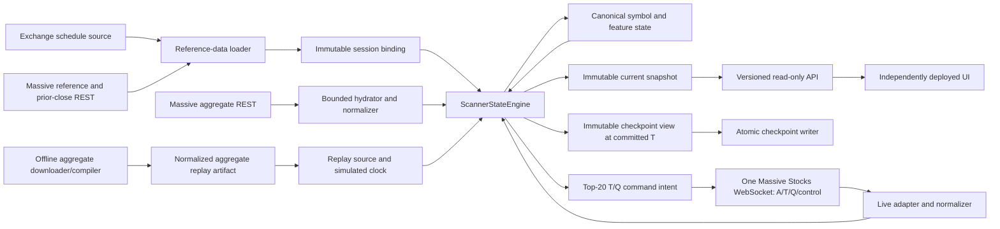
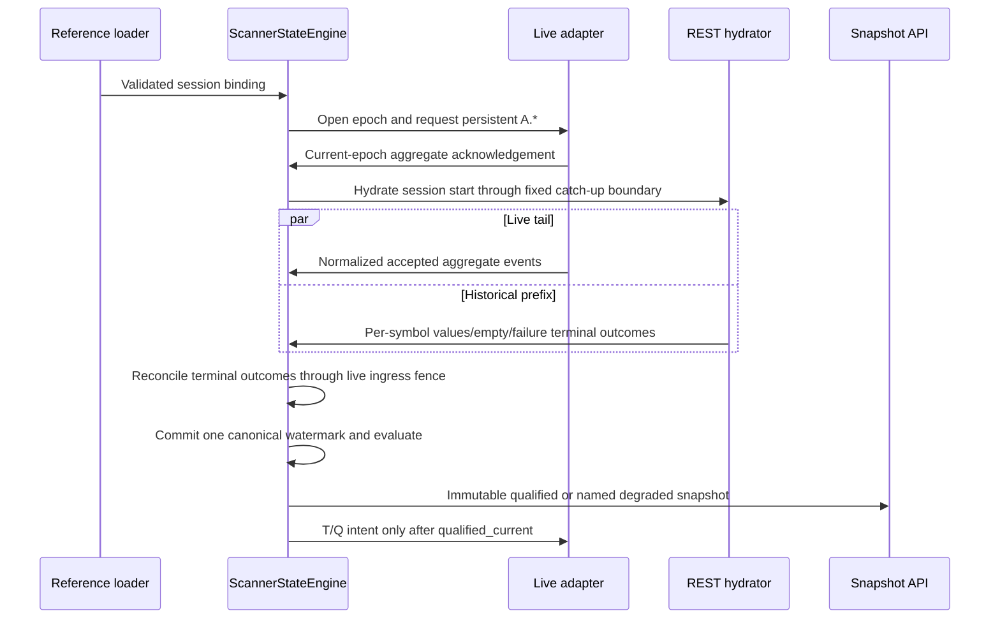

# System overview

**Status:** Approved architecture contract.

**Prepared:** 2026-08-05

**Approved:** 2026-08-05

**Scope:** Runtime topology, component responsibilities, state ownership,
end-to-end data flow, failure boundaries, and links to deeper specifications.
Provider field mappings, formulas already fixed by the product contract,
numeric capacity thresholds, private data structures, and package layout belong
in focused specifications or implementation decisions.

## 1. Authority and purpose

[`../product/product-goals.md`](../product/product-goals.md) is the product-level
authority. This document defines the architecture that implements it. It may not
weaken product behavior, invent new ranking inputs, or turn implementation
convenience into a user-facing fallback.

The scanner is one bounded market-data pipeline:

```text
obtain session reference data
  -> normalize live, historical, or replay market events
  -> apply accepted events to one canonical session state
  -> advance one committed aggregate watermark
  -> evaluate features, qualification, and exact ranking
  -> publish one immutable snapshot
  -> persist coherent restart state
  -> serve a separately deployable UI
```

The predecessor established useful Massive protocol behavior, aggregate merge
rules, feature formulas, bounded state techniques, T/Q measurements, and
fixtures. It also demonstrated the failure mode this architecture must avoid:
bootstrap, recovery, health, ranking, checkpoint, and T/Q state became competing
authorities. A successful 5,533-symbol REST generation could end in
`deferred`, freeze the ordinary ranking clock, report 2,487 proven no-print
symbols as unresolved debt, make aggregate freshness stale while ingress still
flowed, and prevent all T/Q selection.

This architecture therefore reuses reviewed behavior, not the predecessor's
control-plane structure.

## 2. Architectural conclusion

Version 1 is one backend process plus one independently deployable UI.

The backend contains logical modules for reference data, Massive live transport,
REST hydration, normalization, canonical state, features, ranking, T/Q,
checkpoints, replay, snapshot publication, and the read-only API. These modules
are not microservices and do not own competing copies of scanner truth.

The `ScannerStateEngine` is the only component that mutates authoritative
scanner state. Network readers, REST workers, replay readers, checkpoint
writers, and HTTP handlers may run concurrently, but they communicate with the
engine through bounded inputs or immutable outputs. They never mutate canonical
symbol state, lifecycle, committed time, ranking, or readiness directly.

The UI is built and deployed separately. It consumes the versioned backend API
and owns presentation only.

## 3. System context



### 3.1 External inputs

Version 1 depends on four external input classes:

| Input | Product use | Architectural boundary |
| --- | --- | --- |
| Exchange schedule | Determine trading date, immediately preceding completed regular session, and 04:00–20:00 ET bounds. | Produces deterministic session configuration; does not mutate live state. |
| Massive reference and prior-close REST | Build the eligible `CS`/`ADRC` universe and adjusted-prior-close binding. | Produces immutable reference data with dates, policies, and identities. |
| Massive Stocks WebSocket | Persistent `A.*` plus dynamic `T` and `Q`, connection/control messages, and acknowledgements. | One live adapter normalizes provider messages and reports connection epochs; it does not decide ranking readiness. |
| Massive aggregate REST | Fresh hydration, checkpoint catch-up, and known gap recovery. | The hydrator returns normalized aggregates and one explicit terminal outcome per requested symbol. |

Offline aggregate artifacts are local inputs produced from historical REST data.
They enter through the replay boundary and never impersonate proof of live
transport latency or arrival chronology.

### 3.2 Outputs

The backend produces:

- an immutable current scanner snapshot;
- read-only readiness, accounting, and bounded diagnostics;
- T/Q subscribe and unsubscribe intent for the live adapter;
- coherent derived checkpoints for restart; and
- optional local replay outputs used for offline review.

The backend does not produce orders, trade instructions, or browser-owned
market state.

## 4. Ownership model

### ARCH-OWN-01 — one authoritative state owner

`ScannerStateEngine` exclusively owns:

- session lifecycle;
- active session binding;
- connection epoch and accepted recovery generation;
- canonical per-symbol aggregate, trade, quote, qualification, and feature
  state;
- hydration/recovery outcome state;
- committed aggregate watermark;
- exact symbol and work accounting;
- T/Q desired membership and coverage state;
- current ranking and field availability;
- readiness derivation inputs; and
- creation of immutable snapshots and checkpoint views.

Only the engine's ordered execution path may change those facts.

### ARCH-OWN-02 — concurrent components return facts, not mutations

The following work may be concurrent:

- WebSocket reading and minimal event classification;
- provider payload normalization and validation;
- bounded REST requests and pagination;
- replay artifact reading;
- checkpoint file encoding and atomic replacement;
- API request handling; and
- UI rendering.

Concurrent work returns normalized events, terminal results, immutable views, or
I/O outcomes. It does not receive writable references to engine state.

### ARCH-OWN-03 — immutable publication boundary

Ranking evaluation produces an immutable snapshot associated with one committed
watermark. The API reads only the latest published snapshot, not live engine
maps. A slow API client or UI cannot hold the engine lock, delay state mutation,
or observe half-applied recovery state.

### ARCH-OWN-04 — modules are not new authorities

Feature calculators, ranking logic, T/Q coverage logic, accounting, and
checkpoint projection may be separate packages or modules. Their state remains
contained in or exclusively invoked by `ScannerStateEngine`. Separating code for
clarity must not recreate multiple mutable owners.

## 5. High-level components

### 5.1 Session configuration and clock

The clock/configuration component supplies:

- trading date and `America/New_York` session bounds;
- schedule-derived prior-session date;
- live wall/receipt time;
- deterministic replay time;
- committed-watermark target inputs;
- ranking limit and normal T/Q target of 20; and
- approved runtime bounds and feature windows.

All time-dependent modules consume this component. Direct, inconsistent wall
clock access is prohibited where it could affect product state or tests.

The detailed time contract belongs in
[`data-time-and-event-contract.md`](data-time-and-event-contract.md).

### 5.2 Reference-data loader

The loader obtains and validates the eligible universe and adjusted prior
closes required by `PG-UNIVERSE-01` and `PG-REFERENCE-01`. It produces an
immutable session binding containing the exact dates, policies, population, and
deterministic identities required to validate checkpoints and historical work.

Reference retrieval failures do not authorize a guessed universe or prior
close. The product contract controls whether a validated cache is current,
observable-only, or unusable.

### 5.3 Live Massive adapter

Version 1 uses one Massive Stocks WebSocket for persistent `A.*` and dynamic
selected-symbol `T`/`Q`. One socket preserves the provider behavior already
demonstrated by the predecessor and avoids coordinating two transport epochs.

The adapter owns:

- connection/authentication mechanics;
- provider subscription writes;
- raw frame bounds;
- provider message decoding;
- minimal event-type classification;
- connection/control acknowledgement parsing;
- provider-field normalization; and
- reporting transport/decoder outcomes to the engine.

It does not own canonical marks, qualification, ranking, product readiness,
feature availability, or recovery completion.

The shared socket must continue to be read under T/Q pressure. A complete frame
cannot be discarded merely because it contains T/Q: the same frame may contain
aggregates or control acknowledgements. Pressure degradation may reject T/Q
after classification and before expensive feature work; sustained pressure may
cause the engine to request T/Q unsubscription.

### 5.4 Historical aggregate hydrator

The hydrator performs bounded concurrent REST discovery for explicit symbols,
intervals, binding, and generation. It owns provider pagination, retries,
request concurrency, response bounds, and REST-field normalization.

For every planned symbol it returns exactly one terminal outcome:

```text
completed_value | completed_empty | failed | canceled | fenced
```

The hydrator does not decide what an empty result means to rankability. The
engine establishes `no_print_through(T)` only after the result and relevant live
ingress are causally reconciled.

### 5.5 Replay downloader, compiler, and source

The offline downloader/compiler obtains historical one-second aggregates and
creates a normalized replay artifact. The replay source reads that artifact,
advances a simulated clock, and sends the same normalized aggregate event type
to the engine that the live adapter produces.

Replay enters at the normalized-event boundary, not through a fake WebSocket.
Provider framing is tested at the live-adapter boundary; full-session replay
tests product state without unnecessary network emulation.

Version 1 does not download or replay full-session T/Q. Synthetic or bounded
captured fixtures may test T/Q normalization and measurements independently.

### 5.6 Scanner State Engine

The engine is a small ordered coordinator around explicit modules. For each
state-changing input it:

1. validates session binding, connection epoch, generation, interval, and
   causal position as applicable;
2. classifies the result as accepted, rejected, duplicate, terminal, or fenced;
3. applies accepted market facts to canonical symbol state;
4. updates exact accounting and coverage;
5. advances committed time when its causal requirements are satisfied;
6. invokes affected feature, qualification, and ranking calculations;
7. derives T/Q intent, readiness, and bounded diagnostics;
8. publishes an immutable snapshot when observable output changes; and
9. creates an immutable checkpoint view when cadence and coherence permit.

It does not perform blocking network, file, or UI operations on its ordered
state-mutation path.

The lifecycle contract belongs in
[`scanner-state-engine-lifecycle.md`](scanner-state-engine-lifecycle.md).

### 5.7 Canonical symbol and feature state

The engine owns one bounded state record per configured symbol. Its logical
shape is:

```text
SymbolState
  reference
    eligibility and adjusted prior close

  core aggregate
    mark value | no_print_through(T) | invalid | unknown
    bounded mutable correction tail
    session prefix/derived structures
    aggregate coverage and integrity

  qualification
    unresolved | provisional proof | finalized session latch | failed through T

  aggregate features
    session open/high/low
    rolling extrema
    Activity state

  selected-symbol T/Q
    desired/subscription/coverage state
    bounded trade and quote state
    Tape Rate and Spread state

  availability
    independent status and reason for each field
```

This is a logical contract, not a required programming-language struct.

Features remain explicit modules. A new feature may consume normalized
aggregates, trades, quotes, or combinations without altering engine lifecycle.
Its focused specification must define its input, coverage, event-time window,
bounded state, update/correction behavior, availability, ranking effect,
checkpoint behavior, and primary proof.

There is no generic runtime plugin system. New feature code is compiled and
reviewed with the scanner.

### 5.8 Feature and qualification evaluation

Feature modules update from accepted canonical events and committed-watermark
changes. They may maintain bounded derived structures so the engine need not
retain the full raw session.

Version 1 implements the product-approved aggregate fields, aggregate
qualification, Tape Rate, and Spread. Each field independently reports
`warming`, `current`, `stale`, `unavailable`, or `invalid` with a bounded reason.

Only the approved aggregate qualification affects table membership. Day return
is the sole numeric ordering field. T/Q and historical display fields do not
feed ranking.

### 5.9 Ranking and accounting evaluator

One evaluator operates on the canonical state at committed watermark `T`. It:

- partitions the complete universe into the mutually exclusive primary states
  required by `PG-OBS-01`;
- updates qualification for otherwise rankable symbols;
- filters nonqualified symbols before ordering;
- orders by Day return descending and exact symbol ascending;
- publishes at most 20 rows;
- reports the complete postqualification passer count; and
- reports overlapping qualification, feature, and T/Q dimensions separately.

The same evaluator is used during ordinary live operation and after fresh
bootstrap, checkpoint catch-up, or same-process recovery. `degraded_bootstrap`
uses the same canonical state but an explicitly different product projection:
raw Day-% over the currently known rankable population, with unresolved
categories exposed and no T/Q promotion.

### 5.10 T/Q coverage and pressure module

For every committed `qualified_current` snapshot, normal desired T/Q membership
is all displayed rows, up to 20. The module translates changes into paired
subscribe/unsubscribe intent for the live adapter and consumes current-epoch
acknowledgements through the engine.

Its conceptual pressure states are:

| State | T/Q action | Aggregate guarantee |
| --- | --- | --- |
| `normal` | Normalize and process selected-symbol T/Q for all displayed rows. | Aggregate/control processing remains highest priority. |
| `taq_degraded` | Continue draining and classifying the shared socket, but reject T/Q before expensive feature-state mutation. | Aggregate acceptance, committed time, and ranking continue. |
| `aggregate_only` | Request removal of some or all T/Q subscriptions to reduce wire load. | Persistent `A.*` and provider-control processing continue. |

After any coverage gap, affected T/Q state is explicitly unavailable or warming
until new continuous coverage satisfies the feature contract. Old measurements
are not bridged across the gap.

T/Q capability, entitlement, control, decoder, coverage, or measurement failure
cannot mutate aggregate qualification, ranking, aggregate fields, or backend
readiness.

### 5.11 Checkpoint projector and writer

At an eligible committed watermark, the engine creates an immutable checkpoint
view containing the minimum state needed to reproduce aggregate-derived output
at that exact boundary. The projector must include mutable-tail contributions
that are part of the view or mark the dependent domain incomplete; it cannot
combine a newer mark with older range, qualification, or Activity state.

The file writer receives that immutable view, encodes and validates it, writes a
temporary file, and atomically replaces the last complete checkpoint. File I/O
does not block or inspect live engine state.

On restart, only a compatible, structurally and semantically valid checkpoint
may be installed. Ephemeral WebSocket membership and instantaneous T/Q
measurements do not survive connection loss; they warm from the new epoch.

### 5.12 Snapshot store and read-only API

The engine atomically replaces the latest immutable snapshot. HTTP handlers read
that snapshot and expose versioned product, readiness, accounting, and bounded
operational fields.

The API does not reconstruct readiness, recalculate features, inspect provider
state, or mutate the engine. Internal structures do not automatically define the
public JSON schema.

The API runs in the scanner backend process in version 1. This avoids a second
runtime service and consistency boundary while preserving UI independence.

### 5.13 Independent UI

The UI is a separate build and deployment. It consumes only the versioned API,
owns presentation and interaction, and contains no authoritative market
calculation or readiness logic.

A compatible UI update must not restart, relink, or redeploy the backend. The
choice of polling, server-sent events, or WebSocket snapshot delivery belongs to
the API/UI specification and does not change this boundary.

## 6. End-to-end runtime flows

### 6.1 Fresh start



The live aggregate connection begins before potentially long hydration so the
gap does not move while REST work runs. Valid live events may update canonical
state during hydration. REST and live identities reconcile through the same
merge policy.

All required historical work eventually reaches a terminal outcome. A valid
empty result is resolved no-print state; a failed or fenced result remains an
explicit unknown/failure state. Terminal work does not stay pending.

When hydration finishes, the engine enters ordinary live evaluation even if few
symbols have printed or qualified. It does not require every symbol to acquire a
mark.

If the product predicates in `PG-RANK-05` are satisfied before exact
qualification completeness, the engine may publish `degraded_bootstrap`.
Otherwise it publishes unavailable status. New T/Q subscriptions wait for
`qualified_current`.

### 6.2 Checkpoint restart

```text
load current reference binding
  -> discover and validate latest compatible checkpoint
  -> install checkpoint state at sealed T0
  -> establish and acknowledge new aggregate epoch
  -> hydrate [T0, catch-up boundary)
  -> accept live tail concurrently
  -> reconcile through live fence
  -> use ordinary evaluator
  -> warm new T/Q coverage
```

Checkpoint loading changes startup cost, not product semantics. If no compatible
checkpoint exists, startup follows the fresh path. The exact cadence, retained
format, and restart objective belong in the checkpoint specification.

### 6.3 Ordinary live aggregate processing

```text
shared socket frame
  -> classify and normalize A event
  -> bounded engine input
  -> validate epoch/session/identity
  -> canonical merge
  -> update affected derived state
  -> advance committed watermark on the clock contract
  -> evaluate qualification and ranking
  -> publish immutable snapshot
  -> derive T/Q membership changes
```

Accepted aggregate changes always have a path to ordinary evaluation. Hydration,
checkpoint, T/Q, API, or UI state cannot permanently bypass that path.

Committed-watermark ticks may also trigger evaluation when missing trailing
seconds, time-window expiry, finalization beyond the correction horizon, mark
age, or field freshness changes without a new aggregate for that symbol.

### 6.4 Same-process transport recovery

```text
aggregate coverage loss detected
  -> stop labeling new ranking current
  -> preserve last canonical state and explicit stale/unavailable output
  -> establish and acknowledge a new connection epoch
  -> bind the exact missing interval
  -> hydrate terminal outcomes while accepting new live tail
  -> reconcile generation, epoch, interval, and ingress fence
  -> return to ordinary evaluation
```

There is no separate recovery ranking engine, recovery-only mark truth, or
recovery watermark. Recovery supplies missing facts to the same state and
evaluator used by live operation.

A global binding or ingress-integrity ambiguity may suppress ranking. A local
symbol failure affects that symbol and the completeness state it actually
prevents; it does not fabricate global correctness or erase unrelated canonical
state.

### 6.5 T/Q processing

```text
qualified_current top 20
  -> engine updates desired T/Q membership
  -> live adapter writes subscription changes
  -> current-epoch acknowledgements return to engine
  -> coverage begins at the acknowledged causal boundary
  -> normalized trades and quotes update bounded selected-symbol state
  -> Tape Rate and Spread warm and publish independently
```

If T/Q load threatens aggregate timeliness, the engine first rejects expensive
T/Q processing and then requests unsubscription if pressure persists. The
socket reader continues draining frames and preserving aggregate/control events.

### 6.6 Checkpoint production

```text
committed state at T satisfies cadence
  -> engine creates immutable coherent checkpoint view at T
  -> writer encodes and validates view
  -> writer writes temporary file
  -> writer atomically replaces latest complete checkpoint
  -> write outcome returns as bounded operational event
```

An export or write failure does not freeze ranking. The engine records an
explicit reason and retries only under the checkpoint policy.

### 6.7 Aggregate replay

```text
historical REST downloader
  -> normalized aggregate artifact
  -> deterministic replay source
  -> simulated clock + normalized aggregate events
  -> same ScannerStateEngine state/features/ranking/snapshots
```

Playback speed changes wall duration, not event-time output. Replay does not use
the live WebSocket adapter and does not claim to reproduce network latency,
provider arrival order, or unrecorded corrections.

Replay may start from session open or from a compatible checkpoint plus a
historical continuation, allowing restart and catch-up behavior to be tested
offline.

## 7. Ordering, queues, and backpressure

### ARCH-FLOW-01 — bounded input

Every live, hydration, replay, and control input to the engine is bounded. Exact
queue counts, byte limits, and batching are component-specification decisions,
but unbounded buffering is prohibited.

### ARCH-FLOW-02 — accepted work is never silently dropped

If a normalized aggregate is accepted into the engine's bounded input, it must
be processed, explicitly rejected with a bounded reason, or cause a fail-closed
global integrity transition. It cannot disappear because a recovery generation,
checkpoint, or T/Q state changed.

T/Q events may be deliberately rejected under the approved pressure state only
after they are classified so aggregate and control data are preserved. Those
rejections close T/Q coverage and are observable; they are not silent data
loss.

### ARCH-FLOW-03 — ordering metadata is explicit

Connection epoch, ingress position, historical generation, requested interval,
provider event time, and local receipt time are carried as required by the
event contract. State code does not infer ordering from goroutine completion or
map iteration.

### ARCH-FLOW-04 — blocking I/O stays outside the engine

The engine may request work and consume its results, but it does not wait on
provider HTTP, socket writes, disk writes, or UI clients on its ordered path.

## 8. Failure-domain boundaries

| Failure | Required containment |
| --- | --- |
| Missing/invalid prior close | Symbol unrankable; primary accounting remains exact. |
| Valid empty hydration | Symbol becomes `no_print_through(T)`; work completes; live evaluation continues. |
| Symbol REST failure or fenced result | Explicit unknown/failure category; no fabricated no-print proof. |
| Invalid aggregate for one symbol | Symbol-local integrity/availability unless evidence establishes global ambiguity. |
| Aggregate connection loss | Ranking ceases to be current; recover the exact gap into canonical state. |
| Global binding or ingress ambiguity | Suppress claims that require the ambiguous state. |
| Historical feature gap | Only dependent historical fields degrade. |
| T/Q entitlement, control, decode, or coverage failure | T/Q fields degrade; aggregate ranking and readiness do not. |
| T/Q overload | Reject or unsubscribe T/Q before aggregate timeliness is threatened. |
| Checkpoint export/write failure | Record reason and retain prior complete checkpoint; live ranking continues. |
| Invalid checkpoint at startup | Reject it and use an older compatible checkpoint or fresh hydration. |
| API/UI failure | Backend market processing and checkpointing continue. |
| Replay artifact failure | Offline run fails explicitly; it cannot affect the live backend. |

## 9. Snapshot, readiness, and accounting boundaries

One immutable snapshot contains the product-visible relationships required to
interpret a table:

- session/reference binding identity;
- generated time and committed watermark;
- ranking status and reason;
- qualified or degraded rows;
- complete primary symbol accounting;
- qualification and field-availability dimensions;
- aggregate transport and processing state;
- T/Q desired, covered, warming, degraded, and unavailable state;
- hydration/recovery work accounting;
- checkpoint status; and
- bounded operational reasons.

The snapshot distinguishes the four product concepts in `PG-OBS-03`:

1. process live;
2. backend ready;
3. ranking current and its named status; and
4. field/T/Q currentness.

There is one committed ranking watermark. Hydration stages, checkpoints, API
generation, and T/Q coverage may have their own progress boundaries but cannot
replace or override that watermark.

Primary accounting is mutually exclusive and exact:

```text
universe_total
  = valid_prior_close
  + invalid_or_missing_prior_close

valid_prior_close
  = trusted_rankable_mark
  + trusted_below_price_mark
  + no_print_through_T
  + invalid_mark
  + unknown_due_failure_or_fence
```

Historical work independently reconciles:

```text
planned
  = completed_value
  + completed_empty
  + failed
  + canceled
  + fenced
```

Qualification, historical fields, Activity, T/Q coverage, and invariant
diagnostics are overlapping dimensions and are never used to force the primary
identity to balance.

Exact timing thresholds and HTTP status mappings belong in the readiness and
operations specification.

## 10. Deployment and repository boundaries

### 10.1 Version 1 deployment units

Version 1 has two required deployment units:

1. **Scanner backend:** one process containing market-data adapters,
   `ScannerStateEngine`, checkpointing, immutable snapshot store, and read-only
   API.
2. **Web UI:** a separate static or application deployment consuming the
   versioned API.

Splitting the backend into scanner and API services would add a networked state
consistency problem without a version 1 product benefit. It requires a future
documented operational need and architecture change.

### 10.2 Suggested source boundaries, not mandated directories

Implementation should preserve recognizable boundaries for:

```text
session configuration and clocks
reference data
Massive live adapter
Massive REST/hydration adapter
normalized events
ScannerStateEngine and canonical state
features and qualification
ranking and accounting
T/Q coverage and measurements
checkpoint projection/codec/storage
replay downloader/source
snapshot API
independent UI
```

The implementation language, exact packages, files, channel layout, and helper
types remain lower-level decisions provided these ownership boundaries and
invariants remain visible.

## 11. Reuse boundary

The predecessor is not a runtime dependency. Reuse is selective and contract
first.

| Candidate behavior | Required treatment |
| --- | --- |
| Massive A/T/Q/control fixtures and acknowledged protocol behavior | Preserve as reviewed fixtures and adapter expectations. |
| Aggregate validation, identity, correction, duplicate, late, and out-of-order rules | Reuse behavior; port only the smallest understandable implementation after specification. |
| Qualification and ranking formulas | Reimplement or extract against the approved product contract and golden expected outputs. |
| Bounded range and Activity structures | Reuse only after proving exact corrected-path and checkpoint behavior. |
| REST pagination, retry, and terminal empty handling | Reuse evidenced provider mechanics; replace recovery ownership. |
| T/Q condition, acknowledgement, Tape Rate, Spread, and pressure findings | Preserve behavior and fixtures; simplify state around top-20 normal coverage. |
| Checkpoint codec ideas | Preserve validation requirements; do not copy mixed-as-of-time projection. |
| API field meanings and UI presentation | Port selectively after the new snapshot contract; keep deployment independent. |
| Owner/recovery/planner/readiness orchestration | Do not transplant. Replace with this architecture and the lifecycle specification. |

## 12. Deeper specifications required before implementation

This overview intentionally leaves detailed behavior to focused documents:

1. data, time, normalized-event identity, and ordering;
2. Scanner State Engine lifecycle and transition table;
3. universe, schedule, and adjusted-prior-close binding;
4. Massive live adapter and provider fixtures;
5. canonical symbol state and feature-extension contract;
6. hydration, gap recovery, terminal outcomes, and merge policy;
7. aggregate features, qualification, ranking, and exact accounting;
8. T/Q coverage, conditions, measurements, pressure, and warm-up;
9. checkpoint contents, validation, cadence, atomic storage, and restart target;
10. aggregate replay artifact, clock, controls, and provider-data restrictions;
11. readiness thresholds, diagnostics, shutdown, and operational policy;
12. versioned snapshot API and independent UI integration; and
13. test strategy, evidence registry, differential replay, shadowing, and
    cutover.

Implementation must conform to its applicable finalized product, architecture,
component, and proof contracts.

## 13. Architectural invariants

The following invariants are binding:

1. There is one authoritative `ScannerStateEngine` and one canonical symbol
   state per session binding.
2. There is one committed aggregate ranking watermark and one ordinary ranking
   evaluator.
3. Live and REST aggregates normalize to the same canonical identity and merge
   rules.
4. Successful empty hydration is terminal no-print evidence, not unresolved
   work or a synthetic mark.
5. Every planned hydration symbol reaches exactly one terminal work outcome.
6. All accepted aggregate changes retain a path to ordinary committed
   evaluation.
7. No terminal recovery state can freeze ordinary evaluation without an event
   capable of exiting it.
8. Features have independent coverage and availability; display-only features
   do not become implicit ranking inputs.
9. T/Q is normal for all displayed rows but degrades before aggregate
   correctness and never controls aggregate readiness.
10. Checkpoints and snapshots each represent one coherent committed boundary.
11. API handlers, checkpoint writers, adapters, replay readers, and the UI do
    not mutate canonical state.
12. The UI is deployable without restarting the scanner backend.
13. Primary symbol and historical work accounting reconcile without residual
    categories.
14. Bounded queues and retained state are required; accepted work is not
    silently dropped.
15. Replay uses the same normalized aggregate and state path as live operation,
    while making no unsupported live-transport claims.

## 14. Normative requirements and delegated decisions

### 14.1 Normative architecture requirements

The following architectural choices are binding:

- one backend process for scanner state, checkpointing, and API;
- one separately deployed UI;
- one Massive Stocks WebSocket for aggregate and selected T/Q data;
- one ordered `ScannerStateEngine` as the sole mutable authority;
- direct bounded component inputs rather than a generalized event bus;
- one canonical state and evaluator shared by live, hydration, recovery, and
  replay;
- normalized-event replay rather than full-session fake-WebSocket replay;
- explicit compiled feature modules rather than a generic plugin framework;
- immutable snapshot and checkpoint views for concurrent readers/writers;
- default top-20 T/Q with aggregate-protecting degradation; and
- selective predecessor reuse with no runtime dependency.

### 14.2 Decisions intentionally delegated to deeper specifications

The following remain necessary but should be resolved with their direct
evidence and proof plan:

1. implementation language and build/deployment tooling;
2. aggregate correction horizon, evaluation delay, freshness thresholds, and
   queue bounds;
3. exact normalized-event schemas and live/REST conflict policy;
4. REST concurrency, retry, timeout, and total-work bounds;
5. per-feature retained structures and correction algorithms;
6. T/Q pressure thresholds, hysteresis, restoration timing, and condition
   fixtures;
7. checkpoint cadence, format, retained-state representation, and restart-time
   objective;
8. replay artifact format, storage location, retention, privacy, and provider
   license constraints;
9. API update transport and compatible schema-evolution policy;
10. predecessor UI reuse versus replacement; and
11. exact offline, shadow, and cutover acceptance thresholds.

These are not permissions for implementation agents to change the architecture.
Each must be settled in the named specification or ADR before dependent code is
authorized.
